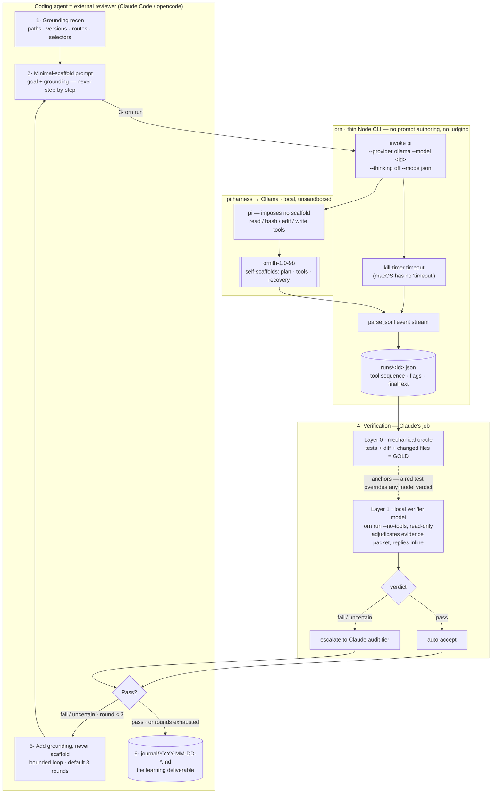

# ornith-loop — Design

_Date: 2026-07-07_

## North star: why pi + ornith

Ornith is not a normal coding model with agentic ability bolted on. It is trained
(RL) to generate not only the solution but the **scaffold** that drives it — the plan,
the tool-call sequence, the error recovery. Self-scaffolding is the family's defining
trait (Ornith = bird, builds its own nest). Its distinctive feature is precisely **not
needing a pre-packaged human scaffold**.

Pi is the minimalist harness by design: four tools (Read, Write, Edit, Bash), no plan
mode, no imposed phase structure. Its philosophy is that the agent builds the structure
it needs, not the harness.

The fit: the thing that makes ornith interesting is exactly the thing pi leaves it room
to do. **This tool must not steal ornith's nest.**

### The distinction that drives everything

A hard-won lesson: supplying facts is not the same as imposing scaffold.

| Kind of help | Who provides it | Notes |
|---|---|---|
| **Reasoning scaffold** — plan, tool sequence, error recovery | **Ornith** (do NOT impose) | What pi leaves room for; the wrapper must not take it away |
| **Grounding / context** — real paths, versions, routes, selectors, conventions | The wrapper | Knowledge the model cannot derive. Providing it ≠ thinking for it |
| **Verification & observability** — what it did, where it broke | The wrapper (two-tier; see below) | The real value, and what makes the experiment measurable |

Guiding principle: **minimal imposed scaffold, maximal grounding, observability and
verification at the centre.** Give ornith the goal plus the grounding it cannot know,
then let it build its own nest — and measure how well it does.

### Two-tier verification

Verification is split into two layers, and the split is what keeps it trustworthy:

- **Layer 0 — the mechanical oracle.** Deterministic, local, no LLM: run the tests, check
  the diff is in scope (`git status`), byte-guard against in-place corruption. Exit 0 = pass.
  It reads the workdir and the `runs/<id>.json` record — **never any agent's prose**. This is
  the anchor of truth (`benchmarks/tasks/*/oracle.mjs`). On real tasks that ship no oracle,
  the *mechanical* part (running tests, computing the diff) is still done by the host, not a
  model.
- **Layer 1 — the LLM reviewer.** Judgement the oracle can't encode: is the diff in scope for
  *this* goal, is there corruption, what corrective grounding is missing. Runs **local-first**
  — a lightweight Ollama verifier model adjudicates a ground-truth evidence packet
  (`verifier/rubric.md`) and returns `pass` / `fail` / `uncertain`. A `pass` is accepted;
  `fail` and `uncertain` **escalate to the Claude audit tier**. The `uncertain` state is the
  safety valve: a model unsure of a run escalates instead of guessing, so a real failure is
  never silently green-lit.

Why the tiers, not a single local judge: a local model in the reviewing seat has been
observed to confabulate (`BENCHMARK.md` — qwen-35b misread a run record). Since ornith itself
confabulates, two confabulators would erase the only independent check. The mechanical oracle
plus the escalate-on-doubt rule preserve it. Which local model is safe *enough* to be the
first pass is decided empirically (`docs/VERIFIER.md`), by its **false-pass rate** against the
oracle — not by assumption.

## Goal & non-goals

**Goal:** a repeatable, observable harness to experiment with local self-scaffolding
models (ornith first) under pi, learn which grounding/prompts let their self-scaffolding
succeed, and capture that knowledge.

**Non-goals:**
- Not a token/cost optimisation.
- Not a production automation tool.
- No auto-escalation, no configurable "scaffold dial" (philosophy is fixed: minimal
  scaffold).

**Superseded non-goal (kept for the record).** Earlier design forbade a *local reviewer
model* ("review is Claude, by choice"). That is now qualified: verification is **two-tier**
(see below). Layer 0 — the mechanical oracle — was always local; Layer 1 — the LLM reviewer
— may run **local-first** (a lightweight Ollama model as first pass) with Claude retained as
the audit/fallback tier for `fail`/`uncertain` verdicts. The change is explicitly *not* about
cost (cost/speed remain non-goals; the executor↔verifier model-swap cost on a single GPU is
accepted). It exists to let the harness run **without a remote LLM in the common path**,
while keeping an independent check — because a local model in the reviewing seat has been
observed to confabulate (see `BENCHMARK.md`), so it cannot be the *only* judge.

## Architecture

Three components, standalone repo at `~/projects/giuseppeoncia/ornith-loop`.

### 1. `orn` — thin CLI (Node)

Encapsulates the mechanical pi-invocation best-practices discovered by hand, plus
observability. Node so invocation and jsonl parsing live in one language (same ecosystem
as pi; Node v24 present).

Responsibilities:
- Invoke `pi -p <prompt> --provider ollama --model <model> --thinking <level> --mode json --name <label>`.
  Defaults: model `ornith-1.0-9b-64k`, thinking `off` (empirically required — thinking-on
  leaks tool calls into the reasoning channel as text).
- Enforce a timeout (Node child-process kill timer; macOS has no `timeout`).
- Pass environment through to pi (so the pi subprocess — not sandboxed like Claude's tools —
  can read `.env`, credentials, etc.).
- Capture pi's json event stream to a per-run log.
- **Observability**: parse the event stream into a run summary — exit reason
  (completed / timeout / error), the **sequence of real tool calls** (ornith's self-built
  plan), count of thinking blocks, the final assistant text, and heuristic flags:
  `tool-call-as-text detected` (the `<tool_call>` failure mode), `stopped before any tool
  call`, `claimed done` (final text contains a done-marker).
- Write a structured run record (JSON) under `runs/` and print the human summary.

Sketch (not final):
```
orn run --prompt-file <path> [--model <id>] [--thinking off] [--timeout 900] [--label <name>]
orn run "<inline prompt>"
```

Explicitly out of scope for the CLI: it does not author prompts, does not decide grounding,
does not verify correctness. Those are the skill's / Claude's job.

### 2. `ornith-loop` — cross-harness skill

A single `SKILL.md` that runs under any coding agent (Claude Code and opencode), installed
via `orn install-skill`. Whichever agent executes it **is** the external reviewer, using its
own model — Claude Code by default, opencode supported. Encodes the method (minimal-scaffold).
Steps the host agent follows:
1. **Grounding**: recon the target repo — real paths, versions, routes, selectors,
   conventions the model cannot know.
2. **Author a minimal-scaffold prompt**: goal + grounding, *not* step-by-step micro-tasks.
3. **Run** via `orn`; let ornith self-scaffold.
4. **Verify externally**: build / tests / diff / rendered output — never trust ornith's
   self-report (it confabulates success). Optionally offload the first pass to a local
   verifier model (two-tier verification, above); audit its `fail`/`uncertain` yourself.
5. **Corrective round if needed**: add *grounding*, not scaffold; bounded to `N` rounds
   (default 3). If still failing, report the failure mode rather than spoon-feeding.
6. **Journal** the observations.

Guardrails encoded (as grounding, not scaffold): prefer write-from-scratch and additive
edits over in-place rewrites of existing files (a known ornith corruption mode); always
verify outside the model.

### 3. Experiment journal

Markdown under `journal/` (one file per run or an append log — decided in the plan). Each
entry: task, model, prompt (or link to run record), what the self-scaffold did (tool
sequence), where it broke, external-verification verdict, notes. This is the accumulated
knowledge — the primary deliverable of the "learning" goal.

## Data flow

The diagram below captures both the **architecture** (the three components) and the
**operating loop** (the skill's numbered steps 1–6). The golden rule is visible in it:
ornith **self-scaffolds** (the pi → Ollama stack), the host supplies only **grounding** on
corrective rounds (never scaffold), and **verification is two-tier** with the mechanical
oracle as the anchor of truth.



The evidence packet Layer 1 adjudicates is **ground truth only** — test output, diff,
changed-file list, and `orn` run signals. It deliberately excludes ornith's own prose (it
confabulates) and the task answer-key (the model must infer scope, as it must on a real
task). See [`VERIFIER.md`](VERIFIER.md).

## Success criteria

These criteria are operationalized into a controlled, falsifiable experiment in
[`BENCHMARK.md`](BENCHMARK.md) — four arms (full method vs bare ornith / heavy-scaffold /
single-shot) that measure whether the method lifts ornith's task **success rate**, with a
pre-committed honest-null clause so "usability wrapper, not performance multiplier" is a
valid outcome.

- Re-running today's kind of task takes one `ornith-loop` invocation, not ad-hoc manual steps.
- Every run yields an observability summary showing ornith's self-built tool sequence and
  any failure-mode flags.
- The journal accumulates comparable entries across runs/models, so "which grounding makes
  self-scaffolding succeed" becomes an answerable, evidence-backed question.
- `orn` is usable standalone (invocation + summary) without the skill.

## Open items — Resolved (see plan)

The implementation plan resolved the three items above: per-run self-contained journal
files under `journal/` (see `journal/README.md`); a run record with `schemaVersion: 1`
under `runs/`; and an optional `--workdir` git snapshot (before/after) powering the
"claimed done but nothing changed" heuristic.
